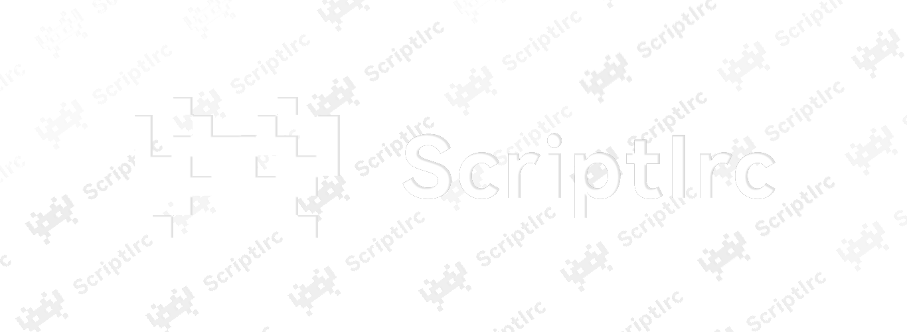

## ScriptIrc - Let the Agent Build Bukkit Plugins for You

You only need to talk with ScriptIrc’s intelligent Agent in a web page and describe your gameplay and requirements.  
The Agent will design and generate a complete Bukkit plugin project for you (exported as a `.sirc` project file).  
Then, the ScriptIrc compiler plugin on your server will compile this project into a loadable plugin JAR.

- No need to prepare any local IDE, build tool, or JDK project template  
- You mainly focus on discussing “how the plugin should work” with the Agent  
- The compiler plugin only takes care of “safely and reliably turning the Agent‑generated project into a runnable Bukkit plugin”

> Note: In this document, the combination of “Agent + compiler plugin” is collectively referred to as **ScriptIrc**.  
> We only introduce the main features and usage here, without going into low‑level implementation details.

---

## From Idea to Bukkit Plugin: Overall Flow

1. Open ScriptIrc’s chat/project interface in your browser (`https://scriptirc.io/chat`) and talk with the Agent:  
   - Explain your server type, version, and existing plugin ecosystem  
   - Describe the gameplay, rules, and commands you want  
   - Tell the Agent how you expect configuration, permissions, and player experience to work  
2. The Agent will create or modify a **Bukkit plugin project** based on your conversation:  
   - Plan `plugin.yml`, commands, permissions, dependency plugins, etc.  
   - Generate or adjust core logic code and necessary resource files  
   - Keep the whole project centered on the goal of “running as a Bukkit plugin on the server”  
3. When the project reaches a stage you are satisfied with, click “Export Plugin Project (.sirc)” in the web UI to obtain a `.sirc` project file.  
4. Provide the `.sirc` file to the ScriptIrc compiler plugin on your server:  
   - Use the compiler command to turn the `.sirc` project into a Bukkit plugin JAR  
   - Use dynamic loading/reloading to deploy or update the plugin without restarting the server  
5. Whenever you want to change the plugin’s behavior later, just go back to the chat interface, continue talking with the Agent, export a new version `.sirc`, and compile again.

> In simple terms: **the Agent in the browser is responsible for “designing and coding”, while ScriptIrc on the server is responsible for “compiling and loading”.**

---

## Installation: Install the ScriptIrc Compiler Plugin

1. Obtain the **latest ScriptIrc compiler plugin JAR** from the author’s distribution channel.  
2. Place the JAR file into your server’s `plugins/` directory (for example `plugins/ScriptIrc-x.x.x.jar`).  
3. Start or restart the server.  
4. In the server console or in‑game (with sufficient permission), run a command to confirm the plugin has been loaded, for example:  
   - `/scriptirc help` or  
   - `/si help` (if you configured a short alias)  
5. On the first startup, the plugin will automatically create default configs, script directories, and related resources under `plugins/ScriptIrc/`.

> ScriptIrc only relies on the running Minecraft server environment.  
> You do not need to set up any extra local Maven/Gradle project or IDE.

---

## Compiler Commands

> The examples below use `/scriptirc` as the main command. In some environments you can also use the alias `/si`.

### Basic Management Commands

- `/scriptirc help`  
  Show help information and the list of available sub‑commands.

- `/scriptirc list`  
  List currently managed external plugins under ScriptIrc.

- `/scriptirc load <plugin name or JAR file name>`  
  Load the specified plugin from ScriptIrc’s external plugin directory.

- `/scriptirc unload <plugin name>`  
  Unload the specified external plugin.

- `/scriptirc reload <plugin name>`  
  Reload the specified external plugin (equivalent to unloading then loading).

### Compilation Commands

- `/scriptirc compiler <script name>`  
  Compile a **single‑file Java script** (`.java`) in the scripts directory.  
  - Example: `/scriptirc compiler HelloWorld` or `/scriptirc compiler HelloWorld.java`

- `/scriptirc compiler <script name> fixreport`  
  When compilation fails, generate a dependency fix suggestion report to help you locate missing libraries or misconfigured dependencies.

- `/scriptirc compiler <project name>.sirc`  
  Directly unpack and compile from a local `.sirc` project file.  
  - Example: `/scriptirc compiler MyProject.sirc`

- `/scriptirc compiler sirc:<session ID>`  
  Fetch a `.sirc` project from an online session over ScriptIrc Engine WebSocket and compile it.  
  - Example: `/scriptirc compiler sirc:123456`  
  - Suitable when you have finished editing in the online builder and want to compile the latest project on the server using the session ID.

### Project Browsing & Debugging Commands

- `/scriptirc search <class name>` or `/scriptirc findclass <class name>`  
  Search the current server and dependency libraries for the specified class’s fully qualified name, helping you confirm whether a dependency exists.

- `/scriptirc sirctree <project name>`  
  View the virtual directory tree of a `.sirc` project without unpacking it to disk, for quickly understanding the internal file layout.

### Other Utility Commands

- `/ai-builder`  
  Output a clickable link in‑game, guiding players or admins to open the ScriptIrc online builder page (e.g. `http://scriptirc.io/`) for graphical / conversational project creation and editing.

> Actual available commands and arguments may change slightly as versions evolve.  
> Please refer to `/scriptirc help` inside the plugin as the final reference.

---

## Compiler Directory Structure

After installing and running ScriptIrc for the first time, the plugin will create a standard directory structure under `plugins/ScriptIrc/`.  
Common directories include:

- `plugins/ScriptIrc/`  
  Root data directory of the plugin.

- `plugins/ScriptIrc/scripts/`  
  **Script and project workspace**, which includes the following subdirectories:
  - `src/`  
    - Directory for **single‑file Java scripts**.  
    - You can write scripts here and compile them via `/scriptirc compiler <script name>`.
  - `lib/`  
    - Custom dependency library directory.  
    - Put additional JARs that should participate in compilation (such as third‑party APIs) here; they will automatically be added to the classpath.
  - `output/` (default configured as `scripts/output`)  
    - Output directory for JAR plugins compiled by ScriptIrc.  
    - Commands like `/scriptirc load <plugin name>` will load plugins from here.

- `plugins/ScriptIrc/scripts/output/Data/`  
  When “data folder redirection” is enabled, this directory is used as the root data folder for external plugins:  
  every plugin loaded by ScriptIrc will get its own data subdirectory here.

- `plugins/ScriptIrc/messages/`  
  Directory for multi‑language message files, used to customize logs and prompts (e.g. `zh_CN.properties` / `en_US.properties`).

- Other auxiliary directories and configuration files (such as `config.yml`)  
  - Control auto‑reload, log level, localization, and other behaviors.  
  - In most cases, the default configuration is sufficient.

---

## How the Compiler Resolves Dependencies

When compiling scripts or `.sirc` projects, ScriptIrc automatically constructs a compilation classpath that is “as close as possible to the real server environment”, so you don’t have to manage dependencies manually in most cases:

1. **Server‑side Dependencies**  
   - Automatically include the API provided by the currently running Minecraft server core (such as Spigot/Paper).  
   - You can directly use Bukkit/Spigot APIs in your scripts without extra configuration.

2. **ScriptIrc Internal Dependencies**  
   - ScriptIrc shades and relocates some third‑party libraries internally (such as `byte-buddy`), which are automatically available at compile time and runtime.

3. **Custom JARs under `scripts/lib`**  
   - If your script or project needs extra third‑party libraries (for example, Vault API or some custom SDK),  
     just put the corresponding JARs into `plugins/ScriptIrc/scripts/lib/`. They will be included in the classpath automatically during compilation.

4. **Dependency Diagnosis & Fix Suggestions**  
   - When compilation fails due to missing dependencies, you can use:  
     - `/scriptirc compiler <plugin name> fixreport`  
   - ScriptIrc will analyze the compilation errors and give hints like “which dependencies might be missing”, helping you decide which JARs should be placed under `scripts/lib/` or how to adjust your script.

> ScriptIrc does **not** download dependencies from the internet.  
> It only builds the dependency chain based on the current server environment and the contents of `scripts/lib`.

---

## Supported Input Formats: `.java` and `.sirc`

ScriptIrc’s compiler can handle **two types of input**:

- **`.java`**: single‑file Java scripts  
- **`.sirc`**: project files (packaged full plugin projects)

In ScriptIrc’s terminology:

- **“Script” specifically refers to a `.java` source file**  
- **“Project file” or “project” specifically refers to a `.sirc` file**

Below we introduce the characteristics and recommended usage of both formats.

---

### `.sirc` Project File (Mainline Project Format)

#### What Is `.sirc`?

- `.sirc` is ScriptIrc’s **project packaging format**, exported by the online editor.  
- In the ScriptIrc web interface, you can click “Export Plugin Project (.sirc)” at the bottom of the “Files” tab; the browser will download a `.sirc` file named after the current project.  
- In essence, `.sirc` is:  
  - A piece of Base64‑encoded JSON;  
  - The JSON contains:  
    - `fileSystem`: the virtual file system tree  
    - `metadata`: project metadata (name, version, dependencies, commands, etc.)

> More formally:  
> `.sirc` = Base64( JSON({ fileSystem, metadata }) )

#### What Does the Inside of a `.sirc` Look Like?

- `fileSystem`  
  - Describes the entire project’s directory and files in a tree structure.  
  - Directories: objects (nested multiple levels)  
  - Files: strings, where each value is `gzip(file content)` encoded again with Base64  
- `metadata`  
  - Includes project name, description, target game version, version number, dependency plugins, commands, permissions, and more.  
  - These metadata values are mapped to `plugin.yml` and related configuration during compilation.

The general decoding process is:

1. Read the `.sirc` text  
2. Base64 decode to get the JSON string  
3. Parse the JSON to obtain `fileSystem` and `metadata`  
4. Recursively traverse `fileSystem`, and for each file node perform “Base64 decode → gzip decompress → write to disk”

Inside ScriptIrc, a dedicated decoder is responsible for this process; you usually do not need to handle it manually.

#### How to Use `.sirc`

- **Main Path for Project Development**  
  - In the online editor, you create a “project” around a specific gameplay or feature, and split files and configs by modules.  
  - When you are satisfied with the project, you export it as a `.sirc` file.

- **Compile `.sirc` on the Server**  
  - Place the `.sirc` file where ScriptIrc can access it, then use for example:  
    - `/scriptirc compiler MyProject.sirc`  
  - Or pull and compile directly from the online Engine via session ID:  
    - `/scriptirc compiler sirc:<session ID>`

- **Project Migration & Sharing**  
  - `.sirc` is a standalone file that can be moved between environments:  
    - You can back it up, share it with others, or compile it again on another server.

#### Online Editor `scriptirc.io/chat`

`scriptirc.io/chat` is ScriptIrc’s public online builder interface (the exact URL may vary by official announcement). Here you can:

- Describe gameplay and rules in natural language, and let the AI assist in generating and adjusting the project structure and code  
- Manage the virtual file system (add / delete / edit files, preview contents)  
- Configure project metadata (name, version, dependencies, commands, permissions, etc.)  
- Export a `.sirc` project file with one click for use by the ScriptIrc compiler on the server

In short: **you build the “project” in the browser and compile the `.sirc` on the server with ScriptIrc.**

---

### `.java` Script Files (Supplementary Format)

In ScriptIrc, **only `.java` source files are called “scripts”**.  
Scripts are a lightweight entry point compared to `.sirc` project files and are suitable for users familiar with Java to implement small features quickly.

#### Where Are Scripts Placed?

- On the server: `plugins/ScriptIrc/scripts/src/`  
- Each `.java` file in this directory can be treated as an independent script.  
- Current design requirement: **one script = one source file**; please do not split the logic into multiple source files.

#### What Structure Should a Script Follow?

(The following summarizes the main points of the script development guidelines.  
For full details, please refer to the script development guide document in this repository.)

- The script’s main class must extend `JavaPlugin`, making it a standard Bukkit/Spigot plugin main class.  
- You can provide metadata (used to generate `plugin.yml`) in two ways:  
  1. **Static field approach**: such as `VERSION`, `DESCRIPTION`, `AUTHOR`, `COMMANDS`, `PERMISSIONS`, etc.  
  2. **Comment/tag approach**: use tags like `@pluginName`, `@version`, `@description`, `[command]...[/command]`, `[permission]...[/permission]` in the class JavaDoc.
- Commands and permissions can be declared collectively through array fields or comment tags, and ScriptIrc will automatically fill them into the generated `plugin.yml`.

#### How to Compile & Load Scripts?

- Compile script:  
  - `/scriptirc compiler <script file name>`  
  - For example: `/scriptirc compiler HelloWorld.java` or `/scriptirc compiler HelloWorld`

- Get dependency suggestions when compilation fails:  
  - `/scriptirc compiler <script file name> fixreport`

- Load the compiled plugin:  
  - `/scriptirc load <plugin name>`  
  - For example: `/scriptirc load HelloWorld`

> Compared with `.sirc` projects, scripts are better suited for **small tools or quickly testing ideas**.  
> For full gameplay features and long‑term maintenance, we recommend the “project + `.sirc`” path.

---

## Differences Between Scripts and Project Files

| Item                 | Script (`.java` file)                           | Project file (`.sirc`)                                         |
|----------------------|-------------------------------------------------|-----------------------------------------------------------------|
| Form                 | Single Java source file                         | Full project snapshot with multiple files and configs           |
| Development entry    | Write code directly under `scripts/src`         | Build project in the online editor via chat and file views      |
| Complexity           | Suitable for small features and simple logic    | Suitable for mid‑to‑large gameplay and long‑term maintained plugins |
| Metadata management  | Provided by fields or comments in the script    | Centrally managed by project `metadata`                         |
| Portability          | Requires manually packing or copying multiple files | Single `.sirc` file carries the full project                 |
| Recommended scenario | Java‑savvy users writing helper tools           | Main server gameplay and plugins intended for sharing           |
| Role in ScriptIrc    | **Supplementary, lightweight**                  | **Primary, core format**                                       |

You can remember it briefly as:  
**Scripts = you write the code yourself; `.sirc` project files = you co‑develop the plugin with ScriptIrc Engine.**

---

## FAQ

### Q1: Do I have to know Java to use ScriptIrc?

**No.**  
ScriptIrc’s main feature set is designed around the “project + `.sirc`” workflow.  
You can primarily use the online editor via natural language and UI operations to develop projects, with ScriptIrc helping to handle code and structure.  
Scripts are only an additional entry point for users already familiar with Java.

### Q2: Why is `.sirc` recommended over writing everything as scripts?

- `.sirc` is better for complex gameplay and long‑term maintenance, with full directory structure, config, and documentation.  
- It is easier to share and migrate among multiple people and environments, and more convenient for ScriptIrc to manage versions and generate documentation.  
- Scripts are more suitable for “small tools”.

### Q3: What should I do when compilation fails?

1. Check the error information returned by ScriptIrc and the server console logs.  
2. For scripts, you can use `/scriptirc compiler <script name> fixreport` to obtain dependency fix suggestions.  
3. Verify that all required third‑party libraries have been placed into `scripts/lib/`.  
4. For `.sirc` projects, confirm that the exported file is not truncated or corrupted; re‑export it from the online editor if necessary.

### Q4: What if ScriptIrc cannot fetch `.sirc` over WebSocket?

- This usually means ScriptIrc Engine is not connected to the server’s WebSocket service, or there is currently no online local compiler client.  
- You can still export the `.sirc` file from the online editor, upload it to the server manually, and then compile it using `/scriptirc compiler MyProject.sirc`.

### Q5: Can I use both scripts and `.sirc` projects at the same time?

Yes.  
You can run plugins compiled from `.sirc` projects and script‑based plugins on the same server.  
ScriptIrc does not force you to choose only one approach.

---

## License

ScriptIrc is currently provided in **closed‑source** form.  
The specific terms of use, commercial licensing, and limitations for the plugin and related services are subject to the latest official statements from the author.

- Without authorization, please do not decompile, redistribute, or use ScriptIrc beyond the permitted commercial scope.  
- For commercial cooperation or deeper integration, please contact the author through the designated channels.

> This document is for usage instructions only and does not constitute a complete legal license agreement.

---

## Acknowledgements

- Thanks to the Minecraft / Bukkit / Spigot / Paper communities for maintaining their ecosystems and documentation over the long term.  
- Thanks to the server owners, developers, and players who participated in ScriptIrc’s testing and feedback; your suggestions directly pushed the system forward.

If you are using ScriptIrc, you are welcome to briefly introduce it to players or peers in appropriate situations,  
so more people can turn their gameplay ideas into real, running plugins on servers without being blocked by tedious environment setup.

